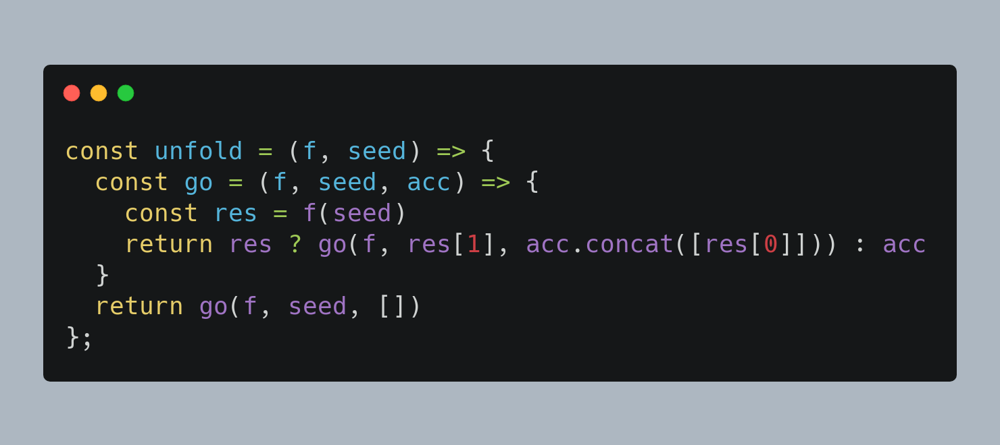

# MessageToCarbon
> 🎨 Get beautiful images of your code in your favorite group of developers on Whatsapp.

## 💭 Description:

<p>
Creating beautiful images with carbon.sh is great, but creating them while chatting on your favorite WhatsApp group of developers is much more amazing.
</p>

## 🕹️ Usage:

<p>
Just by adding three crasis quotes (```) before the code, you will tell messageToCarbon that it should transform that message into an image made in Carbon.sh
</p>

### Example:


```javascript
```const unfold = (f, seed) => {
  const go = (f, seed, acc) => {
    const res = f(seed)
    return res ? go(f, res[1], acc.concat([res[0]])) : acc
  }
  return go(f, seed, [])
};
```

### Output:



## 💻 Tech Stack:

The following tools were used in the construction of the project:
- [JavaScript](https://www.javascript.com/)
- [Node.Js](https://nodejs.org/)
- [Python](https://www.python.org/)
- [Venom](https://github.com/orkestral/venom)


### ©️ Copyrights

Licensed with MIT. The person who made this has nothing to do with [Carbon](https://carbon.now.sh) and WhatsApp. Therefore All rights reserved to [Carbon](https://carbon.now.sh) and WhatsApp.


---

> LinkedIn [Cleo-menezes-jr](https://www.linkedin.com/in/cleo-menezes-jr/) &nbsp;&middot;&nbsp;
> GitHub [CleoMenezes](https://github.com/CleoMenezes) &nbsp;&middot;&nbsp;
> Twitter [@Menemezis](https://twitter.com/Menemezis) &nbsp;&middot;&nbsp;
> Instagram [@cleo.menemezes](https://www.instagram.com/cleo.menemezes/) &nbsp;&middot;&nbsp;